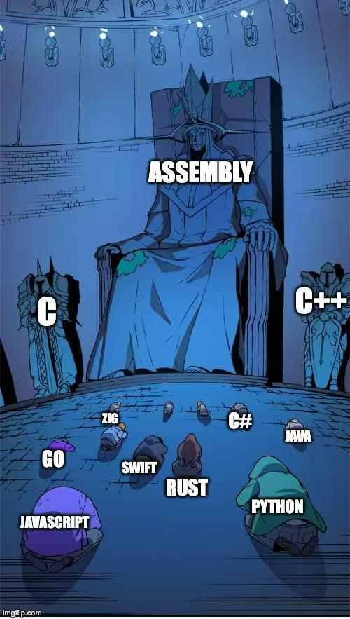

# learning_go_plan9_assembly
Collect various materials in the process of learning go plan9 assembly and share notes.

# Documents to download
* [A Manual for the Plan 9 assembler](downloads/A%20Manual%20for%20the%20Plan%209%20assembler.pdf)
* [PPT: Go Functions In Assembly](downloads/GoFunctionsInAssembly.pdf)
* [AS:gnu Assembler manual](downloads/gnu%20Assembler%20manual.pdf)
* Intel / Amd64 platform:
  - [Intel-Intrinsics-Guide-Offline-3.6.6](downloads/Intel-Intrinsics-Guide-Offline-3.6.6.zip)
  - [x86 intrinsics cheat sheet v1.0](downloads/x86%20intrinsics%20cheat%20sheet%20v1.0.pdf)

# Examples
* test all registers: [examples/allregisters/](examples/allregisters/)
* Arguments and return values: [examples/arg_and_ret/](examples/arg_and_ret/)
* Use golang global variable: [examples/global_variable/](examples/global_variable/)
  - plan9 global variable and static data: [examples/static_data/](examples/static_data/)
* Local variables and push/pop stack: [examples/push_pop_stack/](examples/push_pop_stack/)
* Call go func: [examples/call_go_func/](examples/call_go_func/)
* Caesar Crypt: [examples/caesar_crypt/](examples/caesar_crypt/)
  - go plan9 assembly version: [examples/caesar_crypt/caesar/plan9asm/caesar_plain.s](examples/caesar_crypt/caesar/plan9asm/caesar_plain.s)
  - go plan9 assembly + avx2 version: [examples/caesar_crypt/caesar/plan9asm/caesar_avx2.s](examples/caesar_crypt/caesar/plan9asm/caesar_avx2.s)
* ARM64
  * [move mask](examples/arm64/move_mask/README.md)

# Awesome tools
* goat
  - https://github.com/gorse-io/goat
  - Go assembly transpiler for C programming language
  - `goat src/avx_mul_to.c -O3 -mavx -mfma -mavx512f -mavx512dq`

# Notes
(Chinese)
* [Go plan9 汇编笔记](notes/Go%20plan9%20汇编笔记.md)
  - 整理之中，很乱，还有很多错误
* [Go plan9 汇编笔记](notes/Go%20plan9%20汇编笔记_arm64.md)

# Useful Links
* [FFmpeg/asm-lessons](https://github.com/FFmpeg/asm-lessons)

说说我的感受：
* 摩尔定律走到尽头，算法优化走入深水区
* 从 clickhouse 的经验来看， 向量化+JIT 是未来算法深入优化的方向
* golang 做系统软件当然比不上 c++ 和 rust ，但越来越多的云上大系统使用 golang，因此进一步提升 golang 的运行效率势在必行
* 某些热点可以用 cgo 编写代码，然后使用 [fastcgo](https://github.com/petermattis/fastcgo) 调用
  - 编译仍然很麻烦
  - fastcgo 会产生额外的 `runtime._ExternalCode` 开销（还没搞明白为什么）
* 某些工具号称可以把 intel 汇编转换成 go plan9 汇编：
  - 测试了好几个都不靠谱
  - 包括：
    - https://github.com/chenzhuoyu/asm2asm  (python 3.8)
    - https://github.com/minio/c2goasm + https://github.com/minio/asm2plan9s
  - 某些简单的代码能够翻译过来，但是一旦包含 avx 指令就不行了
* 某些库可以用 golang 的语法来写汇编，然后以 jit 的方式编译为函数：
  - https://github.com/modern-go/amd64
  - 这个思路非常不错。但我需要会写汇编之后，才能用好这个库

总之，在 golang 原生支持 SIMD 之前，学习 plan9 汇编还是非常有必要的。
plan9汇编资料少，且很多指令与官方文档不一致，还要特殊考虑怎么与 golang 结合。
这里面有大量我不会的知识，实在令人兴奋。（又可以玩一个烧脑的东西玩很久了）

笔记的整理计划如下：
1. 把 plan9 汇编的基本用法都收集一遍
2. 基于 amd64 平台，写各种例子
3. 对 AVX2 的常用指令集做一个对照表，方便像使用 gcc 的内置函数一样写 simd 代码。
4. 做一些工具，成为一个更靠谱的汇编代码的生成器
5. 做一些 JIT 的框架，通过简单的编写就能产生高性能的向量化代码。

有兴趣的人也可以一起参与。
:-)
