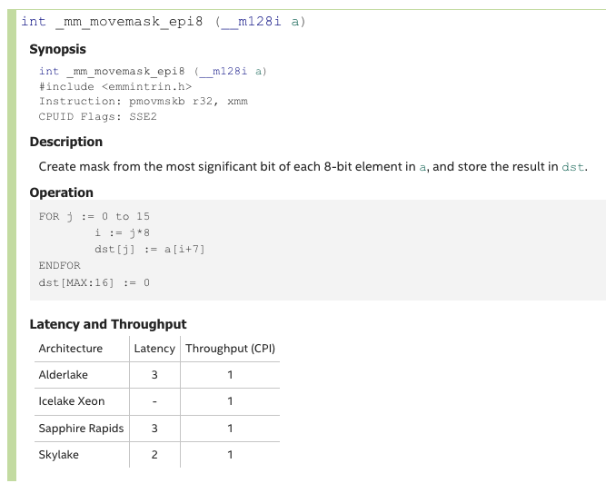
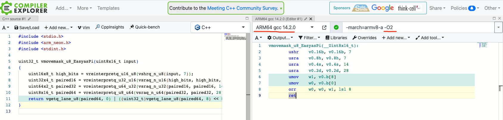

arm64 中没有 amd64 下的 SSE2 指令 `pmovmskb`(C 函数为 [_mm_movemask_epi8](https://www.intel.com/content/www/us/en/docs/intrinsics-guide/index.html#text=_mm_movemask_epi8&ig_expand=5801,4106,6491,6548,4603,877,5870,1002,4602,4602) ).



为了能够在 arm64 平台中使用这个指令，我用 golang plan9 汇编实现了一个。

## 开发步骤
### 1. 用 C 实现
see: [c/move_mask.c](./c/move_mask.c)

```c
#include <stdio.h>
#include <arm_neon.h>
#include <stdint.h>

static inline uint32_t vmovemask_u8_EasyasPi(uint8x16_t input)
{
    // Shift out everything but the sign bits
    uint16x8_t high_bits = vreinterpretq_u16_u8(vshrq_n_u8(input, 7));
    // Merge the even lanes together
    uint32x4_t paired16 = vreinterpretq_u32_u16(vsraq_n_u16(high_bits, high_bits, 7));
    uint64x2_t paired32 = vreinterpretq_u64_u32(vsraq_n_u32(paired16, paired16, 14));
    uint8x16_t paired64 = vreinterpretq_u8_u64(vsraq_n_u64(paired32, paired32, 28));
    // Extract the low 8 bits from each lane and join
    return vgetq_lane_u8(paired64, 0) | ((uint32_t)vgetq_lane_u8(paired64, 8) << 8);
}
```

### 2. 把 c 编译为汇编代码
* 浏览器打开：https://godbolt.org/
* 粘贴上面的 c 代码
* 编译器选择 arm64 下的 gcc
* 编译选项中使用 -O2 或者 O3



最终得到如下汇编代码：
```asm
vmovemask_u8_EasyasPi(__Uint8x16_t):
        ushr    v0.16b, v0.16b, 7
        usra    v0.8h, v0.8h, 7
        usra    v0.4s, v0.4s, 14
        usra    v0.2d, v0.2d, 28
        umov    w1, v0.b[8]
        umov    w0, v0.b[0]
        orr     w0, w0, w1, lsl 8
        ret
```

### 3. 把反编译得到的汇编翻译为 golang plan9 汇编
* 使用 vscode 打开 golang 源码目录：
  - github.com/golang/go/src/cmd/internal/obj/arm64/
* 在这个目录下搜索反编译的各种汇编指令
  - 随即可以找到 golang plan9 汇编中对应的指令

```asm
#include "textflag.h"

TEXT ·_mm_movemask_epi8(SB), NOSPLIT | NOFRAME, $0-10
    // 栈帧长度  0
    // 参数 8 字节
    // 返回值 2 字节
	MOVD ptr+0(FP), R1
    //
    VLD1 (R1), [V1.B16]  // _mm_loadu_si128, 不区分对齐还是不对齐
    VUSHR $7, V1.B16, V1.B16 // 右移七位
    // Vector Unsigned Shift Right and Accumulate
    VUSRA $7, V1.H8, V1.H8  // 按照 16 bit 的单位右移并相加
    VUSRA $14, V1.S4, V1.S4  // 按照 32 bit 的单位右移并相加
    VUSRA $28, V1.D2, V1.D2  // 按照 64 bit 的单位右移并相加
    VMOV V1.B[0], R12  // 8 bit to R12
    VMOV V1.B[8], R13  // 8 bit to R13
    LSL $8, R13, R13  // r13 <<= 8
    ORR R12, R13, R13  // r13 |= R12
    MOVH R13, ret1+8(FP)
    RET
```

## 调试
可以使用 dlv 来调试 golang plan9 汇编：
```shell
dlv test -- -test.v -test.timeout 30s -test.run ^Test_mm_movemask_epi8$
b Test_mm_movemask_epi8  # 在测试函数上设置断点
c  # 开始执行
n  # 执行下一行
s  # 进入函数内执行
regs  # 显示寄存器的内容
```

这里有个问题是无法展示Vx寄存器(128bit simd寄存器)的内容。
可以通过笨办法来解决：
* 在某个汇编代码之后，把这个寄存器的值写入内存：
  - 下面的例子中，操作完成寄存器 V1 后，需要查看 V1 中的内容是否是期望的值。这时候可以使用指令`vst1`把v1寄存器的内容写入R1指向的内存中。

```asm
    VUSRA $7, V1.H8, V1.H8  // 按照 16 bit 的单位右移并相加
      VST1 [V1.B16], (R1)  // 用于调试
```

* 通过单步执行，执行到指令 `VST1 [V1.B16], (R1)`之后
* 使用 `bt` 查看堆栈
* 当前正在执行 frame 0. 我们使用了 `VST1` 把寄存器的内容写入了 frame 1 所在的局部变量中。
  - 执行 `frame 1`，切换到前一个栈帧
  - 执行 `p buf` 打印变量。变量的内容即为 v1 寄存器的内容
* 执行 `frame 0`，回到正在执行的栈帧
* 执行 `n` 继续执行下一条指令

调试结束后，删除所有用于调试的 `vst1` 指令。
