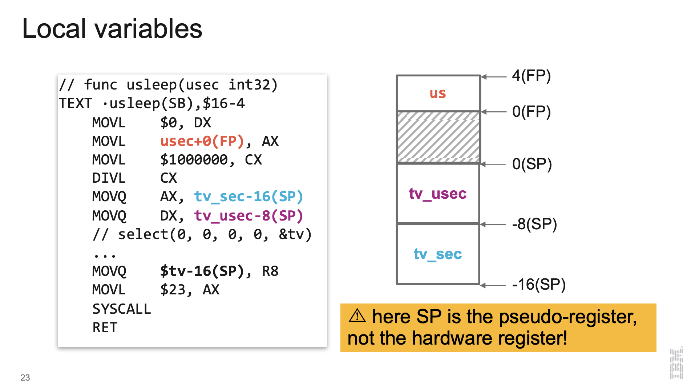

plan 9 汇编笔记

**<font size=1 color=gray>作者:张富春(ahfuzhang)，转载时请注明作者和引用链接，谢谢！</font>**

* <font size=1 color=gray>[cnblogs博客](https://www.cnblogs.com/ahfuzhang/)</font>
* <font size=1 color=gray>[zhihu](https://www.zhihu.com/people/ahfuzhang/posts)</font>
* <font size=1 color=gray>[Github](https://github.com/ahfuzhang)</font>
* <font size=1 color=gray>公众号:一本正经的瞎扯</font>
  

----

[TOC]

**注意**:

* 精力有限，本文档目前只考虑 amd64 平台。
* 本文档只考虑 plan9 汇编与 golang 的结合，并不是单纯的谈 plan9 汇编
* 例子需要在 linux/amd64 平台下编译和运行
  - 对于 macbook arm64 芯片的环境，可以安装 amd64 指令集的 docker 开发容器来模拟
    - `docker pull golang:1.21.3 --platform=linux/amd64`

# 1.plan9 汇编基础知识

## Hello world

```asm
// 这个例子在  golang 1.23 + linux/amd64 下无法编译
#include "textflag.h"
DATA text<>+0(SB)/8,$"Hello Wo"
DATA text<>+8(SB)/8,$"rld!\n"
GLOBL text<>(SB),NOPTR,$16

// func printHelloWorld()
TEXT ·printHelloWorld(SB),$56-0  // 参数 32 字节，还有 24  字节是什么?
  NO_LOCAL_POINTERS
  MOVQ $1, fd-56(SB)    // stdout, fd = 1, 压栈
  MOVQ $text<>+0(SB), AX
  MOVQ AX, ptr-48(SP)   // []byte 的  ptr 部分
  MOVQ $13, len-40(SP)  //  []byte 的 len 部分， 13 个字节
  MOVQ $16, cap-32(SP)  // []byte 的 cap 部分
  CALL syscall·Write(SB)
  RET
```

## plan9 汇编代码的格式总结

* 文件扩展名 xx.s

* 必须出现与 xx.s 对应的  xx.go  文件
  
  * Go 文件中必须声明汇编代码中实现的函数
  * `func FuncName(params)(returns)`

* 注释(与 C 语言一致)
  
  - 单行注释: `//xxx`
  - 多行注释: `/* here */`

* 缩进
  
  - 无任何缩进要求

* 代码通过换行来分隔

* 分号
  
  - 语句后面可以加分号，也可以不加
  - 当需要把多行写到一行上时，需要加分号

* 续行
  
  - 在 `#define` 中支持续行符 `\`

* 操作方向
  
  plan9汇编操作数方向, 与intel汇编方向相反:
  
  ```asm
  //plan9 汇编
  // 指令 src dst
  MOVQ $123, AX  // set ax = 123
  
  //intel汇编
  // 指令  dst, src
  mov rax, 123
  ```

* 寄存器之间的操作
  
  ```asm
  ADDQ R1, R2      //  R2 += R1
  SUBQ R3, R4, R5  // R5 = R4 - R3
  MULQ $7, R6      // R6 *= 7
  ```

* 内存到寄存器的操作
  
  ```asm
  MOVQ (R1), R2         // R2 = *R1
  MOVQ 8(R3), R4        // R4 = *(R3 + 8)
  MOVQ -8(R3), R4       // R4 = *(R3 - 8)
  MOVQ 16(R5)(R6*1), R7 // R7 = *(16 + R5 + R6*1)
  MOVQ ·myvar(SB), R8   // R8 = *myvar
  ```

* 寄存器到内存的操作
  
  ```asm
  MOVQ R2, (R1)
  ```

## 从汇编器反推

目前没有发现太多很官方的文档。但是我们可以从 golang 提供的汇编器的源码，来反推 plan9 汇编的语法格式。

1. 可以从这样一些位置查看整个 golang 项目的源码：
   - https://cs.opensource.google/go/go/+/master:
   - https://github.com/golang/go.git
2. 克隆源码到本地：
   - git clone https://github.com/golang/go.git
3. 汇编器的源码位于：github.com/golang/go/src/cmd/asm
4. 进一步查看语法解析的代码：
   - internal/asm/parse.go

通过注释反推出以下信息：

* 每行的语法定义为：
  * `{label:} WORD[.cond] [ arg {, arg} ] (';' | '\n')`
* 伪指令有如下：
  * DATA, FUNCDATA, GLOBL, PCDATA, PCALIGN, TEXT
* 伪寄存器有如下：
  * FP, PC, SB, SP

## 常数定义

* 十进制
  
  - `$10`, `$123`

* 十六进制
  
  - `$0xff`

* 宏定义
  
  ```asm
  #define MY_NUMBER $1024
  MOVQ MY_NUMBER, R8
  ```

* 指令流中的常数
  当汇编器不支持某些指令的时候，可以按照指令格式直接用常数来表示。
  可以用如下方式在指令流中插入指令数据：
  
  ```asm
  BYTE $0xff  // 8 bit
  WORD $4213  // 16 bit
  LONG $12345678  // 32 bit
  QUAD $0123456789ABCDEF  // 64 bit
  ```

## 静态数据


## 汇编代码中引用 golang 的全局变量

* 定义全局变量

```go
// asm.go
var buf [16]byte    // 128 bit
var _m256i [32]byte // 256 bit
```

* 使用全局变量

```asm
// asm.s
// 全局变量前面一定要加上 ·
//   或者是   包名·全局变量名
MOVOU ·buf(SB), X1
VMOVDQU ·_m256i(SB), Y0
```

```
// 以下笔记内容还未整理


* 声明全局变量

`asm
// asm.s
// 外部标签声明，RODATA 表示只读数据，$16 表示数组的大小为16字节
GLOBL buf(SB), RODATA, $16
GLOBL _m256i(SB), RODATA, $32
`

Variables in assembly are generally read-only values stored in .rodata or .data segments. This corresponds to global const and var variables/constants that have been initialized at the application level.

- DATA can declare and initialize a variable

`
DATA symbol+offset(SB)/width,value
`


  The above statement initializes the symbol+offset(SB) data in width bytes, assigning it to value.(SB operations are all incremental)

- GLOBL declares a global variable

  If under Go package, GLOBL can export the DATA initialized variables for external use

`asm
GLOBL runtime·tlsoffset(SB), NOPTR, $4
// Declare a global variable tlsoffset, 4 byte, with no DATA part because its value is 0.
// NOPTR means that there is no pointer in the data of this variable and the GC does not need to scan it.
`


`asm
DATA K<>+0x00(SB)/4, $0x428a2f98
DATA K<>+0x04(SB)/4, $0x71374491
DATA K<>+0x08(SB)/4, $0xb5c0fbcf
DATA K<>+0x0c(SB)/4, $0xe9b5dba5
DATA K<>+0x10(SB)/4, $0x3956c25b
DATA K<>+0x14(SB)/4, $0x59f111f1
DATA K<>+0x18(SB)/4, $0x923f82a4
DATA K<>+0x1c(SB)/4, $0xab1c5ed5
`


## 变量声明

在汇编里所谓的变量，一般是存储在 .rodata 或者 .data 段中的只读值。对应到应用层的话，就是已初始化过的全局的 const、var、static 变量/常量。

使用 DATA 结合 GLOBL 来定义一个变量。DATA 的用法为:

`go
go
DATA    symbol+offset(SB)/width, value
`

大多数参数都是字面意思，不过这个 offset 需要稍微注意。其含义是该值相对于符号 symbol 的偏移，而不是相对于全局某个地址的偏移。

使用 GLOBL 指令将变量声明为 global，额外接收两个参数，一个是 flag，另一个是变量的总大小。

`go
go
GLOBL divtab(SB), RODATA, $64
`

GLOBL 必须跟在 DATA 指令之后，下面是一个定义了多个 readonly 的全局变量的完整例子:

`go
go
DATA age+0x00(SB)/4, $18  // forever 18
GLOBL age(SB), RODATA, $4

DATA pi+0(SB)/8, $3.1415926
GLOBL pi(SB), RODATA, $8

DATA birthYear+0(SB)/4, $1988
GLOBL birthYear(SB), RODATA, $4
`

正如之前所说，所有符号在声明时，其 offset 一般都是 0。

有时也可能会想在全局变量中定义数组，或字符串，这时候就需要用上非 0 的 offset 了，例如:

`go
go
DATA bio<>+0(SB)/8, $"oh yes i"
DATA bio<>+8(SB)/8, $"am here "
GLOBL bio<>(SB), RODATA, $16
`

大部分都比较好理解，不过这里我们又引入了新的标记 `<>`，这个跟在符号名之后，表示该全局变量只在当前文件中生效，类似于 C 语言中的 static。如果在另外文件中引用该变量的话，会报 `relocation target not found` 的错误。

本小节中提到的 flag，还可以有其它的取值:

> - `NOPROF`  = 1
>    (For  `TEXT`  items.) Don't profile the marked function. This flag is deprecated.
> - `DUPOK`  = 2
>    It is legal to have multiple instances of this symbol in a single binary. The linker will choose one of the duplicates to use.
> - `NOSPLIT`  = 4
>    (For  `TEXT`  items.) Don't insert the preamble to check if the stack must be split. The frame for the routine, plus anything it calls, must fit in the spare space at the top of the stack segment. Used to protect routines such as the stack splitting code itself.
> - `RODATA`  = 8
>    (For  `DATA`  and  `GLOBL`  items.) Put this data in a read-only section.
> - `NOPTR`  = 16
>    (For  `DATA`  and  `GLOBL`  items.) This data contains no pointers and therefore does not need to be scanned by the garbage collector.
> - `WRAPPER`  = 32
>    (For  `TEXT`  items.) This is a wrapper function and should not count as disabling  `recover`.
> - `NEEDCTXT`  = 64
>    (For  `TEXT`  items.) This function is a closure so it uses its incoming context register.

当使用这些 flag 的字面量时，需要在汇编文件中 `#include "textflag.h"`。


作者：Xargin
链接：https://juejin.cn/post/6960300182122528782
来源：稀土掘金
著作权归作者所有。商业转载请联系作者获得授权，非商业转载请注明出处。

----


**TEXT、DATA和BSS：** 这些宏指令用于定义代码段、数据段和未初始化数据段（常用于定义未初始化的全局变量）。

示例：

`
assemblyCopy code
TEXT main(SB), NOSPLIT, $0
    // 函数代码

DATA segment(SB) = 0x1000
    // 数据段

BSS uninitialized_var(SB), 8
    // 未初始化的全局变量
`
```

# 2. 寄存器

amd64 平台下， golang 1.23.1 支持的寄存器列表，请看源码：

github.com/golang/go/src/cmd/internal/obj/x86/list6.go

```go
var Register = []string{ // amd64 下的寄存器列表
    "AL", // [D_AL]
    "CL",
    "DL",
    "BL",
    "SPB",
    "BPB",
    "SIB",
    "DIB",
    "R8B",
    "R9B",
    "R10B",
    "R11B",
    "R12B",
    "R13B",
    "R14B",
    "R15B",
    "AX", // [D_AX]
    "CX",
    "DX",
    "BX",
    "SP",
    "BP",
    "SI",
    "DI",
    "R8",
    "R9",
    "R10",
    "R11",
    "R12",
    "R13",
    "R14",
    "R15",
    "AH",
    "CH",
    "DH",
    "BH",
    "F0", // [D_F0]
    "F1",
    "F2",
    "F3",
    "F4",
    "F5",
    "F6",
    "F7",
    "M0",
    "M1",
    "M2",
    "M3",
    "M4",
    "M5",
    "M6",
    "M7",
    "K0",
    "K1",
    "K2",
    "K3",
    "K4",
    "K5",
    "K6",
    "K7",
    "X0",
    "X1",
    "X2",
    "X3",
    "X4",
    "X5",
    "X6",
    "X7",
    "X8",
    "X9",
    "X10",
    "X11",
    "X12",
    "X13",
    "X14",
    "X15",
    "X16",
    "X17",
    "X18",
    "X19",
    "X20",
    "X21",
    "X22",
    "X23",
    "X24",
    "X25",
    "X26",
    "X27",
    "X28",
    "X29",
    "X30",
    "X31",
    "Y0",
    "Y1",
    "Y2",
    "Y3",
    "Y4",
    "Y5",
    "Y6",
    "Y7",
    "Y8",
    "Y9",
    "Y10",
    "Y11",
    "Y12",
    "Y13",
    "Y14",
    "Y15",
    "Y16",
    "Y17",
    "Y18",
    "Y19",
    "Y20",
    "Y21",
    "Y22",
    "Y23",
    "Y24",
    "Y25",
    "Y26",
    "Y27",
    "Y28",
    "Y29",
    "Y30",
    "Y31",
    "Z0",
    "Z1",
    "Z2",
    "Z3",
    "Z4",
    "Z5",
    "Z6",
    "Z7",
    "Z8",
    "Z9",
    "Z10",
    "Z11",
    "Z12",
    "Z13",
    "Z14",
    "Z15",
    "Z16",
    "Z17",
    "Z18",
    "Z19",
    "Z20",
    "Z21",
    "Z22",
    "Z23",
    "Z24",
    "Z25",
    "Z26",
    "Z27",
    "Z28",
    "Z29",
    "Z30",
    "Z31",
    "CS", // [D_CS]
    "SS",
    "DS",
    "ES",
    "FS",
    "GS",
    "GDTR", // [D_GDTR]
    "IDTR", // [D_IDTR]
    "LDTR", // [D_LDTR]
    "MSW",  // [D_MSW]
    "TASK", // [D_TASK]
    "CR0",  // [D_CR]
    "CR1",
    "CR2",
    "CR3",
    "CR4",
    "CR5",
    "CR6",
    "CR7",
    "CR8",
    "CR9",
    "CR10",
    "CR11",
    "CR12",
    "CR13",
    "CR14",
    "CR15",
    "DR0", // [D_DR]
    "DR1",
    "DR2",
    "DR3",
    "DR4",
    "DR5",
    "DR6",
    "DR7",
    "TR0", // [D_TR]
    "TR1",
    "TR2",
    "TR3",
    "TR4",
    "TR5",
    "TR6",
    "TR7",
    "TLS",    // [D_TLS]
    "MAXREG", // [MAXREG]
}
```

## 2.1 通用寄存器

一般使用调试器会看到如下寄存器信息：

```
(lldb) reg read
General Purpose Registers:
       rax = 0x0000000000000005
       rbx = 0x000000c420088000
       rcx = 0x0000000000000000
       rdx = 0x0000000000000000
       rdi = 0x000000c420088008
       rsi = 0x0000000000000000
       rbp = 0x000000c420047f78
       rsp = 0x000000c420047ed8
        r8 = 0x0000000000000004
        r9 = 0x0000000000000000
       r10 = 0x000000c420020001
       r11 = 0x0000000000000202
       r12 = 0x0000000000000000
       r13 = 0x00000000000000f1
       r14 = 0x0000000000000011
       r15 = 0x0000000000000001
       rip = 0x000000000108ef85  int`main.main + 213 at int.go:19
    rflags = 0x0000000000000212
        cs = 0x000000000000002b
        fs = 0x0000000000000000
        gs = 0x0000000000000000
```

intel 汇编里面是 rax,rbx,rcx,rdx,rdi,rsi,r8~r15这14个寄存器。

在plan9汇编里还可以直接使用的amd64的通用寄存器，应用代码层面会用到的通用寄存器主要是: `rax, rbx, rcx, rdx, rdi, rsi, r8~r15`这14个寄存器，虽然`rbp`和`rsp`也可以用，不过`bp`和`sp`会被用来管 理栈顶和栈底，最好不要拿来进行运算。plan9中使用寄存器不需要带`r`或`e`的前缀，例如`rax`，只要写`AX`即可。

下面是通用通用寄存器的名字在 IA64 和 plan9 中的对应关系:

| X86_64 | rax | rbx | rcx | rdx | rdi | rsi | rbp | rsp | r8  | r9  | r10 | r11 | r12 | r13 | r14 | rip |
|:------ |:--- |:--- |:--- |:--- |:--- |:--- |:--- |:--- |:--- |:--- |:--- |:--- |:--- |:--- |:--- |:--- |
| Plan9  | AX  | BX  | CX  | DX  | DI  | SI  | BP  | SP  | R8  | R9  | R10 | R11 | R12 | R13 | R14 | PC  |

```
本小结内容摘录自：
  作者：Xargin
  链接：https://juejin.cn/post/6960300182122528782
  来源：稀土掘金
  著作权归作者所有。商业转载请联系作者获得授权，非商业转载请注明出处。
```

* 通用寄存器的使用例子如下：

```asm
    MOVB $1, AX  // 1 字节
    MOVW $2, BX  // 2 字节
    MOVL $3, CX  // 4 字节
    MOVD $3, CX  // 4 字节
    MOVQ $4, DX  // 8 字节
    MOVQ $0x12345678, BX
    MOVQ $0x12345678, DI
    MOVQ $0x12345678, SI
    MOVQ $0x12345678, R8
    MOVQ $0x12345678, R9
    MOVQ $0x12345678, R10
    MOVQ $0x12345678, R11
    MOVQ $0x12345678, R12
    MOVQ $0x12345678, R13
    MOVQ $0x12345678, R14
```

## 2.2 128 bit SSE 寄存器

X0~X15

* 使用例子

```asm
    XORPS X0, X0  // x0 ^= x0, x0 = 0
    XORPS X1, X1
    XORPS X2, X2
    XORPS X3, X3
    XORPS X4, X4
    XORPS X5, X5
    XORPS X6, X6
    XORPS X7, X7
    XORPS X8, X8
    XORPS X9, X9
    XORPS X10, X10
    XORPS X11, X11
    XORPS X12, X12
    XORPS X13, X13
    XORPS X14, X14
    XORPS X15, X15
    MOVOU buf(SB), X1
```

## 2.3 256 bit AVX2 寄存器

Y0~Y15

* 使用例子

```asm
    VXORPS Y0, Y0, Y0  // 异或指令
    VXORPS Y1, Y1, Y1
    VXORPS Y2, Y2, Y2
    VXORPS Y3, Y3, Y3
    VXORPS Y4, Y4, Y4
    VXORPS Y5, Y5, Y5
    VXORPS Y6, Y6, Y6
    VXORPS Y7, Y7, Y7
    VXORPS Y8, Y8, Y8
    VXORPS Y9, Y9, Y9
    VXORPS Y10, Y10, Y10
    VXORPS Y11, Y11, Y11
    VXORPS Y12, Y12, Y12
    VXORPS Y13, Y13, Y13
    VXORPS Y14, Y14, Y14
    VXORPS Y15, Y15, Y15
    VMOVDQU _m256i(SB), Y0
```

* 注意： Y 系列寄存器的低 128bit 就是 X 系列寄存器

* 读取高  128bit 的数据，可以使用指令 vextracti128
  
  * __m128i _mm256_extracti128_si256 (__m256i a, const int imm8)

## 2.4 512 bit AVX512 寄存器

Z0~Z31

```asm
    VXORPS Z0, Z0, Z0  // 编译 ok, 但是在不支持  avx512 指令集的机器上发生 coredump
    VXORPS Z1,Z1,Z1
    VXORPS Z2,Z2,Z2
    VXORPS Z3,Z3,Z3
    VXORPS Z4,Z4,Z4
    VXORPS Z5,Z5,Z5
    VXORPS Z6,Z6,Z6
    VXORPS Z7,Z7,Z7
    VXORPS Z8,Z8,Z8
    VXORPS Z9,Z9,Z9
    VXORPS Z10,Z1,Z10
    VXORPS Z11,Z1,Z11
    VXORPS Z12,Z1,Z12
    VXORPS Z13,Z1,Z13
    VXORPS Z14,Z1,Z14
    VXORPS Z15,Z1,Z15
    VXORPS Z16,Z1,Z16
    VXORPS Z17,Z1,Z17
    VXORPS Z18,Z1,Z18
    VXORPS Z19,Z1,Z19
    VXORPS Z20,Z2,Z20
    VXORPS Z21,Z2,Z21
    VXORPS Z22,Z2,Z22
    VXORPS Z23,Z2,Z23
    VXORPS Z24,Z2,Z24
    VXORPS Z25,Z2,Z25
    VXORPS Z26,Z2,Z26
    VXORPS Z27,Z2,Z27
    VXORPS Z28,Z2,Z28
    VXORPS Z29,Z2,Z29
    VXORPS Z30,Z3,Z30
    VXORPS Z31,Z3,Z31
```

## 2.5 核心伪寄存器


Go汇编引入了4个伪寄存器，这4个寄存器时编译器用来维护上下文、特殊标识等作用的:

```
FP(Frame pointer):arguments and locals
PC(Program counter): jumps and branches
SB(Static base pointer):global symbols
SP(Stack pointer):top of stack
```

所有用户空间的数据都可以通过FP/SP(局部数据、输入参数、返回值)和SB(全局数据)访问。通常情况下，不会对SB/FP寄存器进行运算操作，通常情况会以SB/FP/SP作为基准地址，进行偏移、解引用等操作

### PC(Program counter)

实际上就是在体系结构的知识中常见的`pc`寄存器，在x86平台下对应`ip`寄存器，amd64上则是`rip`。除了个别跳转 之外，手写代码与`PC`寄存器打交道的情况较少。

```asm
// 指令跳转的时候会用到
JMP 2(PC)  // 以当前指令为基础，向前/后跳转 x 行
JMP -2(PC) // 同上
```

### SB(Static base pointer)

在某些情况下`SB`更像一些声明标识，其标识语句的作用。例如：

1. `TEXT runtime·_divu(SB), NOSPLIT, $16-0` 在这种情况下，`TEXT`·`SB`共同作用声明了一个函数 `runtime._divu`，这种情况下，不能对`SB`进行解引用。
2. `GLOBL fast_udiv_tab<>(SB), RODATA, $64` 在这种情况下，`GLOBL`、`fast_udiv_tab`、`SB`共同作用， 在RODATA段声明了一个私有全局变量`fast_udiv_tab`，大小为64byte，此时可以对`SB`进行偏移、解引用。
3. `CALL runtime·callbackasm1(SB)` 在这种情况下，`CALL`、`runtime·callbackasm1`、`SB`共同标识， 标识调用了一个函数`runtime·callbackasm1`。
4. `MOVW $fast_udiv_tab<>-64(SB), RM` 在这种情况下，与2类似，但不是声明，是解引用全局变量 `fast_udiv_tab`。
* 函数定义的时候会使用
* 引用全局变量会使用

### FP(Frame pointer)

(函数参数和返回值的时候常常使用)

`FP`伪寄存器用来标识函数参数、返回值。其通过`symbol+offset(FP)`的方式进行使用。例如`arg0+0(FP)`表示第函数第一个参数其实的位置（amd64平台），`arg1+8(FP)`表示函数参数偏移8byte的另一个参数。`arg0`/`arg1`用于助记，但是必须存在，否则 无法通过编译。至于这两个参数是输入参数还是返回值，得对应其函数声明的函数个数、位置才能知道。 如果操作命令是`MOVQ arg+8(FP), AX`的话，`MOVQ`表示对8byte长的内存进行移动，其实位置是函数参数偏移8byte 的位置，目的是寄存器`AX`，因此此命令为将一个参数赋值给寄存器`AX`，参数长度是8byte，可能是一个uint64，`FP` 前面的`arg+`是标记。至于`FP`的偏移怎么计算，会在后面的[go函数调用](https://cloud.tencent.com/developer/tools/blog-entry?target=https%3A%2F%2Flrita.github.io%2F2017%2F12%2F12%2Fgolang-asm%2F%23go%E5%87%BD%E6%95%B0%E8%B0%83%E7%94%A8)中进行表述。同时我们 还可以在命令中对`FP`的解引用进行标记，例如`first_arg+0(FP)`将`FP`的起始标记为参数`first_arg`，但是 `first_arg`只是一个标记，在汇编中`first_arg`是不存在的。

### SP(Stack pointer)

`SP`是栈指针寄存器，指向当前函数栈的栈顶，通过`symbol+offset(SP)`的方式使用。offset 的合法取值是 `[-framesize, 0)`，注意是个左闭右开的区间。假如局部变量都是8字节，那么第一个局部变量就可以用`localvar0-8(SP)` 来表示。

但是硬件寄存器中也有一个`SP`。在用户手写的汇编代码中，如果操作`SP`寄存器时没有带`symbol`前缀，则操作的是 硬件寄存器`SP`。在实际情况中硬件寄存器`SP`与伪寄存器`SP`并不指向同一地址，具体硬件寄存器`SP`指向哪里与函 数

但是：

对于编译输出(`go tool compile -S / go tool objdump`)的代码来讲，目前所有的`SP`都是硬件寄存器`SP`，无论 是否带 symbol。

我们这里对容易混淆的几点简单进行说明：

- 伪`SP`和硬件`SP`不是一回事，在手写代码时，伪`SP`和硬件`SP`的区分方法是看该`SP`前是否有`symbol`。如果有 `symbol`，那么即为伪寄存器，如果没有，那么说明是硬件`SP`寄存器。
- 伪`SP`和`FP`的相对位置是会变的，所以不应该尝试用伪`SP`寄存器去找那些用`FP`+offset来引用的值，例如函数的 入参和返回值。
- 官方文档中说的伪`SP`指向stack的top，是有问题的。其指向的局部变量位置实际上是整个栈的栈底（除caller BP 之外），所以说bottom更合适一些。
- 在`go tool objdump/go tool compile -S`输出的代码中，是没有伪`SP`和`FP`寄存器的，我们上面说的区分伪`SP` 和硬件`SP`寄存器的方法，对于上述两个命令的输出结果是没法使用的。在编译和反汇编的结果中，只有真实的`SP`寄 存器。
- `FP`和Go的官方源代码里的`framepointer`不是一回事，源代码里的`framepointer`指的是caller BP寄存器的值， 在这里和caller的伪`SP`是值是相等的。

*注*: 如何理解伪寄存器`FP`和`SP`呢？其实伪寄存器`FP`和`SP`相当于plan9伪汇编中的一个助记符，他们是根据当前函数栈空间计算出来的一个相对于物理寄存器`SP`的一个偏移量坐标。当在一个函数中，如果用户手动修改了物理寄存器`SP`的偏移，则伪寄存器`FP`和`SP`也随之发生对应的偏移。

```
以下笔记未整理

其中

1.SP是栈指针，用来指向局部变量和函数调用的参数，通过symbol+offset(SP)的方式使用。SP指向local stack frame的栈顶，所以使用时需要使用负偏移量，取之范围为[-framesize,0)。foo-8(SP)表示foo的栈第8byte。SP有伪SP和硬件SP的区分，如果硬件支持SP寄存器，那么不加name的时候就是访问硬件寄存器，因此`x-8(SP)`和`-8(SP)`访问的会是不同的内存空间。对SP和PC的访问都应该带上name，若要访问对应的硬件寄存器可以使用RSP。

- 伪SP：本地变量最高起始地址
- 硬件SP：函数栈真实栈顶地址

他们的关系为：

- 若没有本地变量: 伪SP=硬件SP+8
- 若有本地变量:伪SP=硬件SP+16+本地变量空间大小

2.FP伪寄存器

FP伪寄存器:用来标识函数参数、返回值，编译器维护了基于FP偏移的栈上参数指针，0(FP)表示function的第一个参数，8(FP)表示第二个参数(64位系统上)后台加上偏移量就可以访问更多的参数。要访问具体function的参数，编译器强制要求必须使用name来访问FP，比如 foo+0(FP)获取foo的第一个参数，foo+8(FP)获取第二个参数。

与伪SP寄存器的关系是:

- 若本地变量或者栈调用存严格split关系(无NOSPLIT)，伪FP=伪SP+16
- 否则 伪FP=伪SP+8
- FP是访问入参、出参的基址，一般用正向偏移来寻址，SP是访问本地变量的起始基址，一般用负向偏移来寻址
- 修改硬件SP，会引起伪SP、FP同步变化

`
SUBQ $16, SP // 这里golang解引用时，伪SP/FP都会-16
`

3.SB伪寄存器可以理解为原始内存，foo(SB)的意思是用foo来代表内存中的一个地址。foo(SB)可以用来定义全局的function和数据，foo<>(SB)表示foo只在当前文件可见，跟C中的static效果类似。此外可以在引用上加偏移量，如foo+4(SB)表示foo+4bytes的地址
4.参数/本地变量访问

通过symbol+/-offset(FP/SP)的方式进行使用，例如arg0+0(FP)表示函数第一个参数的位置，arg1+8(FP)表示函数参数偏移8byte的另一个参数。arg0/arg1用于助记，但是必须存在，否则无法通过编译(golang会识别并做处理)。

其中对于SP来说，还有一种访问方式: +/-offset(FP) 这里SP前面没有symbol修饰，代表这是硬件SP？？？

5.PC寄存器

实际上就是在体系结构的知识中常见的PC寄存器，在x86平台下对应ip寄存器，amd64上则是rip。除了个别跳转之外，手写代码与PC寄存器打交道的情况较少。

6.BP寄存器

还有BP寄存器，表示已给调用栈的起始栈底(栈的方向从大到小，SP表示栈顶)；一般用的不多，若需要做手动维护调用栈关系，需要用到BP寄存器，手动split调用栈。

7.通用寄存器

在plan9汇编里还可以直接使用amd64的通用寄存器，应用代码层面会用到的通用寄存器主要是:

rax,rbx,rcx,rdx,rdi,rsi,r8~r15这14个寄存器。plan9中使用寄存器不需要带r或e的前缀，例如rax，只要写AX即可:

`
MOVQ $101, AX
`

示例：

`
func Add(a ,b int) (c int){
  sum := 0
  return a + b + sum
}
`

各变量通用寄存器解引用如下:(伪FP=伪SP+16=硬件SP+24)

- a: a+0(SP)或者a+16(SP)
- b: b+8(SP)或者a+24(SP)
- c: c+16(SP)或者a+32(SP)
- sum:sum-8(SP)或者a-24(FP)

8.TLS伪寄存器

该寄存器存储当前goroutine g结构地址


| 助记符 | 名字                            | 用途                                                         |
| :----- | :------------------------------ | :----------------------------------------------------------- |
| AX     | 累加寄存器(AccumulatorRegister) | 用于存放数据，包括算术、操作数、结果和临时存放地址           |
| BX     | 基址寄存器(BaseRegister)        | 用于存放访问存储器时的地址                                   |
| CX     | 计数寄存器(CountRegister)       | 用于保存计算值，用作计数器                                   |
| DX     | 数据寄存器(DataRegister)        | 用于数据传递，在寄存器间接寻址中的I/O指令中存放I/O端口的地址 |
| SP     | 堆栈顶指针(StackPointer)        | 如果是`symbol+offset(SP)`的形式表示go汇编的伪寄存器；如果是`offset(SP)`的形式表示硬件寄存器 |
| BP     | 堆栈基指针(BasePointer)         | 保存在进入函数前的栈顶基址                                   |
| SB     | 静态基指针(StaticBasePointer)   | go汇编的伪寄存器。`foo(SB)`用于表示变量在内存中的地址，`foo+4(SB)`表示foo起始地址往后偏移四字节。一般用来声明函数或全局变量 |
| FP     | 栈帧指针(FramePointer)          | go汇编的伪寄存器。引用函数的输入参数，形式是`symbol+offset(FP)`，例如`arg0+0(FP)` |
| SI     | 源变址寄存器(SourceIndex)       | 用于存放源操作数的偏移地址                                   |
| DI     | 目的寄存器(DestinationIndex)    | 用于存放目的操作数的偏移地址                                 |


## 栈扩大、缩小

plan9中栈操作并没有`push` `pop`，而是采用`sub`和`add SP`

`
SUBQ $0x18, SP //对SP做减法 为函数分配函数栈帧
ADDQ $0x18, SP //对SP做加法  清除函数栈帧
`
```

# 3.函数

## 3.1 函数定义


* 根据TEXT定义函数
* Stack frame size: 代表局部变量的总和，0 代表没有局部变量
* Arguments size: 参数和返回值的总字节数
* 标志部分：
  * 在 `函数名(SB),`之后出现
  * 按位来表示
  * 每一位的定义，请看 textflag.h

## 3.2 函数属性

see: `textflag.h`,

- `NOPROF` = 1
  (For `TEXT` items.) Don't profile the marked function. This flag is deprecated.
- `DUPOK` = 2
  It is legal to have multiple instances of this symbol in a single binary. The linker will choose one of the duplicates to use.
- `NOSPLIT` = 4
  (For `TEXT` items.) Don't insert the preamble to check if the stack must be split. The frame for the routine, plus anything it calls, must fit in the spare space remaining in the current stack segment. Used to protect routines such as the stack splitting code itself.
- `RODATA` = 8
  (For `DATA` and `GLOBL` items.) Put this data in a read-only section.
- `NOPTR` = 16
  (For `DATA` and `GLOBL` items.) This data contains no pointers and therefore does not need to be scanned by the garbage collector.
- `WRAPPER` = 32
  (For `TEXT` items.) This is a wrapper function and should not count as disabling `recover`.
- `NEEDCTXT` = 64
  (For `TEXT` items.) This function is a closure so it uses its incoming context register.
- `LOCAL` = 128
  This symbol is local to the dynamic shared object.
- `TLSBSS` = 256
  (For `DATA` and `GLOBL` items.) Put this data in thread local storage.
- `NOFRAME` = 512
  (For `TEXT` items.) Do not insert instructions to allocate a stack frame and save/restore the return address, even if this is not a leaf function. Only valid on functions that declare a frame size of 0.
- `TOPFRAME` = 2048
  (For `TEXT` items.) Function is the outermost frame of the call stack. Traceback should stop at this function.

## 3.3 函数参数

* All arguments passed on the stack
  * Offsets from FP
* Return arguments follow input arguments
  * Start of return arguments aligned to pointer size
* All registers are caller saved, except:
  * Stack pointer register
  * Zero register (if there is one)
  * G context pointer register (if there is one)
  * Frame pointer (if there is one)


eg: 参数和返回值

```go
// 函数定义
// params.go
package params

func add(a int64, b int64, c int64, d int64) (ret1 int64, ret2 int64)

func Add(a int64, b int64, c int64, d int64) (ret1 int64, ret2 int64) {
    return add(a, b, c, d)
}
```

```asm
// params.s
#include "textflag.h"

TEXT ·add(SB),NOPTR, $0-48
    // 栈帧长度  0
    // 参数+返回值长度  48 字节
    MOVQ a+0(FP), R8
    ADDQ b+8(FP), R8
    MOVQ c+16(FP), R9
    ADDQ d+24(FP), R9
    //
    MOVQ R8,ret1+32(FP)
    MOVQ R9,ret2+40(FP)
    RET
```

## Stack frame 栈帧


## 局部变量



## 栈增长


### 栈相关的 flag


## 逃逸分析


## 堆栈结构


(图片来自：https://chai2010.cn/advanced-go-programming-book/ch3-asm/ch3-06-func-again.html)

## 调用函数

```asm
TEXT runtime·profileloop(SB),NOSPLIT,$8
    MOVQ    $runtime·profileloop1(SB), CX
    MOVQ    CX, 0(SP)
    CALL    runtime·externalthreadhandler(SB)
    RET
```

```asm
#include "textflag.h"

// func output(a,b int) int
TEXT ·output(SB), NOSPLIT, $24-24
    MOVQ a+0(FP), DX // arg a
    MOVQ DX, 0(SP) // arg x
    MOVQ b+8(FP), CX // arg b
    MOVQ CX, 8(SP) // arg y
    CALL ·add(SB) // 在调用 add 之前，已经把参数都通过物理寄存器 SP 搬到了函数的栈顶
    MOVQ 16(SP), AX // add 函数会把返回值放在这个位置
    MOVQ AX, ret+16(FP) // return result
    RET

作者：Xargin
链接：https://juejin.cn/post/6960300182122528782
来源：稀土掘金
著作权归作者所有。商业转载请联系作者获得授权，非商业转载请注明出处。
```

## argsize 和 framesize 计算规则

### argsize

在函数声明中:

```go
go
复制代码 TEXT pkgname·add(SB),NOSPLIT,$16-32
```

前面已经说过 16−32表示16-32 表示 16−32表示framesize-argsize。Go 在函数调用时，参数和返回值都需要由 caller 在其栈帧上备好空间。callee 在声明时仍然需要知道这个 argsize。argsize 的计算方法是，参数大小求和+返回值大小求和，例如入参是 3 个 int64 类型，返回值是 1 个 int64 类型，那么这里的 argsize =  sizeof(int64) * 4。

不过真实世界永远没有我们假设的这么美好，函数参数往往混合了多种类型，还需要考虑内存对齐问题。

如果不确定自己的函数签名需要多大的 argsize，可以通过简单实现一个相同签名的空函数，然后 go tool objdump 来逆向查找应该分配多少空间。

### framesize

函数的 framesize 就稍微复杂一些了，手写代码的 framesize 不需要考虑由编译器插入的 caller BP，要考虑：

1. 局部变量，及其每个变量的 size。
2. 在函数中是否有对其它函数调用时，如果有的话，调用时需要将 callee 的参数、返回值考虑在内。虽然 return address(rip)的值也是存储在 caller 的 stack frame 上的，但是这个过程是由 CALL 指令和 RET 指令完成 PC 寄存器的保存和恢复的，在手写汇编时，同样也是不需要考虑这个 PC 寄存器在栈上所需占用的 8 个字节的。
3. 原则上来说，调用函数时只要不把局部变量覆盖掉就可以了。稍微多分配几个字节的 framesize 也不会死。
4. 在确保逻辑没有问题的前提下，你愿意覆盖局部变量也没有问题。只要保证进入和退出汇编函数时的 caller 和 callee 能正确拿到返回值就可以。

作者：Xargin
链接：https://juejin.cn/post/6960300182122528782
来源：稀土掘金
著作权归作者所有。商业转载请联系作者获得授权，非商业转载请注明出处。

# 4. 控制流

对于函数控制流的跳转，是用label来实现的，label只在函数内可见，类似`goto`语句

```asm
next:
  MOVW $0, R1
  JMP  next
```

## 4.1 跳转

### 1.定义 label 来跳转

```asm
    JMP l1
    NOP
l1:
    NOP
l2: NOP
    NOP
    JMP l2
```

### 2.通过 pc 寄存器跳转

```asm
JMP 2(PC)
NOP
NOP
NOP
NOP
JMP -2(PC)
```

## 4.2 循环

通过 DECQ 和 JZ 结合，可以实现高级语言里的循环逻辑:

```asm
#include "textflag.h"

// func sum(sl []int64) int64
TEXT ·sum(SB), NOSPLIT, $0-32
    MOVQ $0, SI
    MOVQ sl+0(FP), BX // &sl[0], addr of the first elem
    MOVQ sl+8(FP), CX // len(sl)
    INCQ CX           // CX++, 因为要循环 len 次

start:
    DECQ CX       // CX--
    JZ   done
    ADDQ (BX), SI // SI += *BX
    ADDQ $8, BX   // 指针移动
    JMP  start

done:
    // 返回地址是 24 是怎么得来的呢？
    // 可以通过 go tool compile -S math.go 得知
    // 在调用 sum 函数时，会传入三个值，分别为:
    // slice 的首地址、slice 的 len， slice 的 cap
    // 不过我们这里的求和只需要 len，但 cap 依然会占用参数的空间
    // 就是 16(FP)
    MOVQ SI, ret+24(FP)
    RET

作者：Xargin
链接：https://juejin.cn/post/6960300182122528782
来源：稀土掘金
著作权归作者所有。商业转载请联系作者获得授权，非商业转载请注明出处。
```

## 4.3 跳转

* 跳转到一个函数的例子

https://tip.golang.org/src/cmd/vendor/golang.org/x/sys/plan9/asm_plan9_amd64.s

```asm
// Copyright 2009 The Go Authors. All rights reserved.
// Use of this source code is governed by a BSD-style
// license that can be found in the LICENSE file.

#include "textflag.h"

//
// System call support for amd64, Plan 9
//

// Just jump to package syscall's implementation for all these functions.
// The runtime may know about them.

TEXT    ·Syscall(SB),NOSPLIT,$0-64
    JMP    syscall·Syscall(SB)

TEXT    ·Syscall6(SB),NOSPLIT,$0-88
    JMP    syscall·Syscall6(SB)

TEXT ·RawSyscall(SB),NOSPLIT,$0-56
    JMP    syscall·RawSyscall(SB)

TEXT    ·RawSyscall6(SB),NOSPLIT,$0-80
    JMP    syscall·RawSyscall6(SB)

TEXT ·seek(SB),NOSPLIT,$0-56
    JMP    syscall·seek(SB)

TEXT ·exit(SB),NOSPLIT,$8-8
    JMP    syscall·exit(SB)
```

# 5. 指令


## 指令格式


* 一条指令 32  字节

* 主机序（小端）

* 0～15  位(2 字节)代表指令

* 16～19 位，代表第一个寄存器
  
  * 20~24, 寄存器 2
  * 25~28, 寄存器 3
  * 29~32, 寄存器 4

* 可以用 16 进制值直接表示一条指令
  
  * WORD $0xB9C83012
  * BYTE $0xB9; BYTE $0xC8; BYTE $0x30; BYTE $0x12

### 64-bit Instruction Format


## 系统调用

```asm
SYSCALL xxx
```

## 数据搬运

* MOVB

* MOVW

* MOVD, MOVL

* MOVEQ

* 从内存搬运到寄存器

```asm
MOVOU     (DX), X2
MOVOU     16(DX), X1
```

## 算术运算

* ADDQ
  * ADDW, ADDL, ADDB
* SUBQ
* IMULQ AX,BX   // BX *= AX

## 条件跳转/无条件跳转

```
// 无条件跳转
JMP addr   // 跳转到地址，地址可为代码中的地址，不过实际上手写不会出现这种东西
JMP label  // 跳转到标签，可以跳转到同一函数内的标签位置
JMP 2(PC)  // 以当前指令为基础，向前/后跳转 x 行
JMP -2(PC) // 同上

// 有条件跳转
JZ target // 如果 zero flag 被 set 过，则跳转
```

## 地址运算

地址运算也是用 lea 指令，英文原意为 Load Effective Address，amd64 平台地址都是 8 个字节，所以直接就用 LEAQ 就好:

```
LEAQ (BX)(AX*8), CX
// 上面代码中的 8 代表 scale
// scale 只能是 0、2、4、8
// 如果写成其它值:
// LEAQ (BX)(AX*3), CX
// ./a.s:6: bad scale: 3

// 用 LEAQ 的话，即使是两个寄存器值直接相加，也必须提供 scale
// 下面这样是不行的
// LEAQ (BX)(AX), CX
// asm: asmidx: bad address 0/2064/2067
// 正确的写法是
LEAQ (BX)(AX*1), CX


// 在寄存器运算的基础上，可以加上额外的 offset
LEAQ 16(BX)(AX*1), CX  // CX = AX*1 + BX + 16

// 三个寄存器做运算，还是别想了
// LEAQ DX(BX)(AX*8), CX
// ./a.s:13: expected end of operand, found (

作者：Xargin
链接：https://juejin.cn/post/6960300182122528782
来源：稀土掘金
著作权归作者所有。商业转载请联系作者获得授权，非商业转载请注明出处。
```

* 取变量的地址

在Plan 9操作系统的汇编语言中，LEAQ是一个指令，用于将源操作数的地址加载到目标操作数中。具体来说，LEAQ指令的作用是将源操作数的地址（而不是它的内容）加载到目标操作数中。这个指令在计算地址时非常有用，因为它允许你把一个地址加载到一个寄存器中，而不需要访问内存。这可以提高代码的性能，因为访问寄存器比访问内存要快得多。

LEAQ指令的语法通常如下：

```
assemblyCopy code
LEAQ source_operand, destination_operand
```

其中，source_operand是源操作数，它可以是一个内存地址、寄存器或立即数；destination_operand是目标操作数，它通常是一个寄存器。当LEAQ指令执行时，它会将source_operand的地址计算出来，并将结果加载到destination_operand中。

例如，如果你想将内存中的一个变量的地址加载到寄存器RBX中，你可以使用LEAQ指令：

```
assemblyCopy code
LEAQ variable, %RBX
```

这会将变量`variable`的地址计算出来，并将该地址加载到寄存器RBX中，而不会改变变量的内容。

## AVX2 指令

- movups : 把4个不对准的单精度值传送到xmm寄存器或者内存
- movaps : 把4个对准的单精度值传送到xmm寄存器或者内存

## 指令表格

| 含义                       | gcc 内置函数             | intel 指令手册 | golang plan 9 汇编 |
| ------------------------ | -------------------- | ---------- | ---------------- |
| 非对齐的加载 8 bit * 16 数据     | _mm_loadu_si128      | movdqu     | MOVOU            |
| 8 个 8bit, 变成 8 个  32 bit | _mm256_cvtepu8_epi32 | vpmovzxbd  | VPMOVZXBD        |
|                          |                      |            |                  |
|                          |                      |            |                  |
|                          |                      |            |                  |

## 指令大全

### golang源码

See: github.com/golang/go/src/cmd/internal/obj/x86/anames.go

​     以上文件记录了 golang + x86 所支持的所有指令

每条指令的格式，可以通过这里搜索到：

github.com/golang/go/src/cmd/internal/obj/x86/avx_optabs.go

### x86.v0.2.csv

X86 指令大全：

https://github.com/golang/arch/blob/master/x86/x86.v0.2.csv

* 字段含义

```go
    inst := &Inst{
        Intel:     cols[0],
        Go:        cols[1],
        GNU:       cols[2],
        Encoding:  cols[3],
        Mode32:    cols[4],
        Mode64:    cols[5],
        CPUID:     cols[6],
        Tags:      cols[7],
        Action:    cols[8],
        Multisize: cols[9],
        DataSize:  cols[10],
    }
```

* csv 文件格式：

```csv
"VPBROADCASTB xmm1, xmm2/m8","VPBROADCASTB xmm2/m8, xmm1","vpbroadcastb xmm2/m8, xmm1","VEX.128.66.0F38.W0 78 /r","V","V","AVX2","","w,r","",""
```

解析数据的源码：https://github.com/golang/arch/blob/a6bdeed4930798f0aa566beb7883ab0d88dc9646/x86/x86csv/reader.go#L55

### x86.csv

https://github.com/golang/arch/blob/master/x86/x86.csv

字段含义：

```
text, opcode, valid32, valid64, cpuid, tags
```

csv 文件格式：

```
"VPGATHERDD xmm1, vm32x, xmm2","VEX.DDS.128.66.0F38.W0 90 /r","V","V","AVX2",""
"VPGATHERDD ymm1, vm32y, ymm2","VEX.DDS.256.66.0F38.W0 90 /r","V","V","AVX2",""
```

解析数据的源码位置：https://github.com/golang/arch/blob/a6bdeed4930798f0aa566beb7883ab0d88dc9646/x86/x86map/map.go#L214

```
c4 e2 65 90 04 88        vpgatherdd %ymm3,(%rax,%ymm1,4),%ymm0
// c4e265900488
1100 0100 1110 0010 0110 0101 1001 0000 0000 0100 1000 1000
  c   4     e    2    6   5     9    0    0    4    8    8

  bit 0~7: c4 , vex 前缀
  bit 8: 1  R
  bit 9-12  b1100, 额外寄存器编码
  bit 13:   0,
```

VEX前缀（Vector Extension）是用于AVX（Advanced Vector Extensions）指令的编码方案，在二进制级别它提供了对SIMD（单指令多数据流）指令集的扩展。VEX前缀可能是2字节或3字节长，并且它用于替代传统的x86和x86-64指令前缀，允许更多的寄存器和更多的操作指令。

对于2字节的VEX前缀，格式通常是这样的：

```
第1字节: 11000101 (0xC5)
第2字节: RvvvvLpp
```

- 第1字节是固定的，0xC5或者0xC4，取决于是2字节还是3字节的VEX。
- 第2字节包含几个字段：
  - `R` 字段是REX.R的补码（反转），用于扩展寄存器索引。
  - `vvvv` 字段是一个4位的字段，用于额外的寄存器编码，也是REX.R的补码。
  - `L` 字段指示向量长度（0表示128位，1表示256位）。
  - `pp` 字段用于指示操作码前缀（例如，11表示使用两个0x66前缀）。

对于3字节的VEX前缀，格式如下：

```
第1字节: 11000100 (0xC4)
第2字节: R X B mmmmm
第3字节: W vvvv L pp
```

- 第1字节是固定的0xC4。
- 第2字节：
  - `R`, `X`, `B` 字段是REX前缀的补码。
  - `mmmmm` 字段指示封装的操作码字节和逃逸序列（通常是0x0F）。
- 第3字节：
  - `W` 字段是REX.W的补码，用于指示操作数大小。
  - `vvvv` 字段用于额外的寄存器编码，也是REX.R的补码。
  - `L` 字段指示向量长度。
  - `pp` 字段用于指示操作码前缀。

在具体实现中，这些字段会根据指令的需要和寄存器的使用进行设置。每个字段都是针对特定指令或指令组的编码，具体的二进制值会根据指令的不同而不同。

# 与 go 的类型交互

## struct

## string

```c
typedef struct{
    uint64_t ptr;
    uint64_t len;
}StringHeader;
```

## slice

```c
typedef struct{
    uint64_t ptr;
    uint64_t len;
    uint64_t cap;
}SliceHeader;
```

## map

# 编译提示

.s 文件中同样可以使用编译提示

```
//+build !noasm,!appengine,gc
```

# 预处理指令

## #define

```asm
#define ROUND674 \
    PADDL  X7, X0                    \
    LONG   $0xdacb380f               \ // SHA256RNDS2 XMM3, XMM2
    MOVO   X7, X1                    \
    LONG   $0x0f3a0f66; WORD $0x04ce \ // PALIGNR XMM1, XMM6, 4
    PADDL  X1, X4                    \
    LONG   $0xe7cd380f               \ // SHA256MSG2 XMM4, XMM7
    PSHUFD $0x4e, X0, X0             \
    LONG   $0xd3cb380f               \ // SHA256RNDS2 XMM2, XMM3
    LONG   $0xf7cc380f               // SHA256MSG1 XMM6, XMM7
```

使用宏：

```asm
    MOVO 3*16(BX), X0; ROUND674  // rounds 12-15
    MOVO 4*16(BX), X0; ROUND745  // rounds 16-19
    MOVO 5*16(BX), X0; ROUND456  // rounds 20-23
    MOVO 6*16(BX), X0; ROUND567  // rounds 24-27
    MOVO 7*16(BX), X0; ROUND674  // rounds 28-31
    MOVO 8*16(BX), X0; ROUND745  // rounds 32-35
    MOVO 9*16(BX), X0; ROUND456  // rounds 36-39
    MOVO 10*16(BX), X0; ROUND567 // rounds 40-43
    MOVO 11*16(BX), X0; ROUND674 // rounds 44-47
    MOVO 12*16(BX), X0; ROUND745 // rounds 48-51
```

```
#include： 用于包含外部文件的内容。可以用来将其他文件的内容插入到当前文件中。

示例：

assembly
Copy code
#include "file.inc"
#ifdef、#ifndef、#else 和 #endif： 用于条件编译。#ifdef检查一个标识符是否被定义，#ifndef检查一个标识符是否未被定义，#else用于定义条件为假时的替代代码块，#endif表示条件编译的结束。

示例：

assembly
Copy code
#ifdef DEBUG
    // 调试时的代码
#else
    // 发布时的代码
#endif
#undef： 用于取消一个已经定义的宏，使其不再可用。

示例：

assembly
Copy code
#define DEBUG
#ifdef DEBUG
    // 调试时的代码
#endif
#undef DEBUG
```

* 续行

可以使用 `\` 来续行。

```asm
#define SET_ZERO(r) MOVQ $0, r; \
       MOVQ $0, R14
```

## 常量

```asm
#define ZERO $0
MOVQ ZERO, R13
```

## 语句

```asm
#define LINE_CODE MOVQ $0, R13;
LINE_CODE
```

## 函数

```asm
#define MY_INC(r) INCQ r;
MY_INC(R10)
```

# 调试

## dlv 调试器

官网：https://github.com/go-delve/delve

安装：go install github.com/go-delve/delve/cmd/dlv@latest

在代码目录下运行：

dlv debug

* b main.main

* r

* n

* s

* regs: 输出所有寄存器的值

* p 全局变量
  
  * p &tableOfCaesar  打印变量的地址
  * print *(*[5]byte)(uintptr(0x00000000010a4060))   // 直接根据一个地址绝对值来输出

* disassemble   // 输出汇编代码

参考文章：

* https://chai2010.cn/advanced-go-programming-book/ch3-asm/ch3-09-debug.html

## M2 芯片 macbook 上调试 amd64 汇编

mac 上跑 docker

Docker 里面运行 dlv 会出现：`function not implemented`

## 独立编译

```
// 汇编文件的编译
/go/pkg/mod/golang.org/toolchain@v0.0.1-go1.21.3.linux-amd64/pkg/tool/linux_amd64/asm -p caesar/pkg/caesar -trimpath "$WORK/b002=>" -I $WORK/b002/ -I /go/pkg/mod/golang.org/toolchain@v0.0.1-go1.21.3.linux-amd64/pkg/include -D GOOS_linux -D GOARCH_amd64 -D GOAMD64_v1 -gensymabis -o $WORK/b002/symabis ./caesar.s
```

# asm汇编器

汇编器的源码：github.com/golang/go/src/cmd/asm/internal/arch/arch.go

汇编器对指令和寄存器等初始化的代码：

github.com/golang/go/src/cmd/asm/internal/arch/arch.go:105

`func archX86(linkArch *obj.LinkArch) *Arch`

# 链接

* 官网: [A Quick Guide to Go's Assembler](https://go.dev/doc/asm)
* [golang 汇编](https://lrita.github.io/2017/12/12/golang-asm/)
* [fastcgo](https://github.com/petermattis/fastcgo)

```
Fast (but unsafe) Cgo calls via an assembly trampoline. Inspired by rustgo. The UnsafeCall* function takes a pointer to a Cgo function and a number of arguments and executes the function on the "system stack" of the thread the current Goroutine is running on.
```

* [How to call private functions (bind to hidden symbols) in GoLang](https://sitano.github.io/2016/04/28/golang-private/)
* [Golang中的Plan9汇编器](https://github.com/yangyuqian/technical-articles/blob/master/asm/golang-plan9-assembly-cn.md)
* [SIMD Optimization in Go](https://goroutines.com/asm)
* [Go functions in assembly language.pdf](https://lrita.github.io/images/posts/go/GoFunctionsInAssembly.pdf)
* [A Manual for the Plan 9 assembler](http://doc.cat-v.org/plan_9/4th_edition/papers/asm) (非常古老)
* [Intel Intrinsics Guide](https://www.intel.com/content/www/us/en/docs/intrinsics-guide/index.html#ig_expand=0)
* [intel 指令手册离线下载](https://cdrdv2.intel.com/v1/dl/getContent/671338)
* https://lrita.github.io/images/posts/go/GoFunctionsInAssembly.pdf
* [go 汇编语言](https://chai2010.cn/advanced-go-programming-book/ch3-asm/index.html)
  * [go 语言高级编程：函数](https://chai2010.cn/advanced-go-programming-book/ch3-asm/ch3-06-func-again.html)
* [amd64 instruction assembler](https://github.com/modern-go/amd64)
* [plan9 assembly 完全解析](https://juejin.cn/post/6960300182122528782)
  * 英文版：[plan9 assembly fully resolved](https://segmentfault.com/a/1190000039978109)
* [Go Assembly Overview](https://www.sobyte.net/post/2022-08/go-assembly/)
* [A Manual for the Plan 9 assembler(pdf)](https://usermanual.wiki/Document/A20Manual20for20the20Plan20920assembler.333142479/view)
* [Go assembly language complementary reference](https://quasilyte.dev/blog/post/go-asm-complementary-reference/)
* [译:go 和 plan9 汇编](https://xargin.com/go-and-plan9-asm/)
  * https://github.com/teh-cmc/go-internals
* gcc 在线编译：https://godbolt.org/
* [打造史上最小可执行ELF文件(45字节)](https://tinylab-1.gitbook.io/cbook/02-chapter8#toc_3928_6176_9)

基本的定义文件：/opt/homebrew/Cellar/go/1.21.3/libexec/pkg/include

* asm_amd64.h
* asm_ppc64x.h
* funcdata.h
* textflag.h

# 看不懂的部分

* ABIInternal

plan 9 汇编中出现 ABIInternal 是什么意思?
ChatGPT
在Plan 9汇编中，ABIInternal是一种特殊的符号命名约定，表示一个函数或者变量是Plan 9操作系统的内部实现细节，不应该被外部代码引用。在Plan 9的源码中，有些函数或者变量被标记为ABIInternal，这意味着它们是Plan 9内部使用的，不属于公共API，不建议外部代码直接引用这些符号。

这种命名约定的目的是为了确保代码的封装性和可维护性。通过将内部实现细节标记为ABIInternal，开发者可以清晰地知道哪些部分是公共API，哪些部分是内部实现，从而避免外部代码直接依赖内部细节，减少代码的耦合度。这样，当内部实现发生变化时，不会影响到外部代码的正确性。

在Plan 9的源码中，你可能会看到一些函数或者变量的命名是以ABIInternal结尾的，比如someFunctionABIInternal。这种命名约定是Plan 9团队为了维护代码的组织结构和清晰度而采取的一种做法。

* FUNCDATA

在Plan 9的汇编语言中，`FUNCDATA`是一个伪指令（pseudo-instruction），用于将关于函数的额外信息关联到函数的代码中。具体来说，`FUNCDATA`指令通常用于存储函数的闭包信息，这些信息对于垃圾回收器等运行时系统非常重要。

`FUNCDATA`指令的语法如下：

```
assemblyCopy code
FUNCDATA $functype, $arg
```

其中，`$functype`表示函数附加信息的类型，`$arg`表示具体的信息或者数据。这个指令通常出现在函数的开头，用于为函数提供附加的元数据。

例如，以下是一个使用`FUNCDATA`指令的示例：

```
assemblyCopy code
TEXT ·myFunction(SB), NOSPLIT, $0
    FUNCDATA $1, $myClosureInfo
    // 函数的实际代码
    RET
```

在这个例子中，`FUNCDATA $1, $myClosureInfo`将附加了一个类型为1的函数信息（例如闭包信息）到`myFunction`函数中。

这种附加信息对于运行时系统非常有用，因为它可以帮助运行时系统更好地理解函数的运行时上下文，例如垃圾回收器可能会使用这些信息来识别函数中的闭包，从而正确地进行垃圾回收。

这里的FUNCDATA是golang编译器自带的指令，plan9和x86的指令集都是没有的。它用来给gc收集进行提示。提示0和0和1是用于局部函数调用参数，需要进行回收。

* NOP命令是作为占位符使用，提供给编译器使用的。可以忽略不看。

#### 数据copy

`
MOVB $1, DI // 1 byte
MOVW $0x10, BX // 2bytes
MOVD $1, DX // 4 bytes
MOVQ $-10, AX // 8 bytes
`

#### 计算指令

`
ADDQ AX, BX // BX += AX
SUBQ AX, BX // BX -= AX
IMULQ AX, BX // BX *= AX
`

#### 跳转

`
//无条件跳转
JMP addr // 跳转到地址，地址可为代码中的地址 不过实际上手写不会出现这种东西
JMP label // 跳转到标签 可以跳转到同一函数内的标签位置
JMP 2(PC) // 以当前置顶为基础，向前/后跳转x行
JMP -2(PC) //同上
//有条件跳转
JNZ target // 如果zero flag被set过，则跳转
`

#### 变量声明

汇编中的变量一般是存储在`.rodata`或者`.data`段中的只读值。对应到应用层就是已经初始化的全局的const、var变量/常量

`
DATA symbol+offset(SB)/width,value
`

上面的语句初始化symbol+offset(SB)的数据中width bytes,赋值为value，相对于栈操作，SB的操作都是增地址，栈时减地址

```
GLOBL runtime·tlsoffset(SB), NOPTR, $4
// 声明一个全局变量tlsoffset，4byte，没有DATA部分，因其值为0。
// NOPTR 表示这个变量数据中不存在指针，GC不需要扫描。
```

（使用DATA结合GLOBL来定义一个变量，GLOBL必须跟在DATA指令之后）当时我尝试了下发现GLOBL不放在DATA之后 也没啥问题，如果知道的小伙伴可以分享一下。

举个栗子：

```
pkg.go
package pkg

var Id int

var Name string
pkg_amd64.s
GLOBL ·Id(SB),$8

DATA ·Id+0(SB)/1,$0x37
DATA ·Id+1(SB)/1,$0x25
DATA ·Id+2(SB)/1,$0x00
DATA ·Id+3(SB)/1,$0x00
DATA ·Id+4(SB)/1,$0x00
DATA ·Id+5(SB)/1,$0x00
DATA ·Id+6(SB)/1,$0x00
DATA ·Id+7(SB)/1,$0x00

GLOBL ·Name(SB),$24
DATA ·Name+0(SB)/8,$·Name+16(SB)
DATA ·Name+8(SB)/8,$6
DATA ·Name+16(SB)/8,$"gopher"
```

#### 函数声明

举个栗子：

```
fun.go
package fun

//go:noinline
func Swap(a, b int) (int, int)
fun_amd64.s
#include "textflag.h"
// func Swap(a,b int) (int,int)
告诉汇编器该数据放到TEXT区
 |          告诉汇编器这是基于静态地址的数据(static base)
 |             |
TEXT fun·Swap(SB),NOSPLIT,$0-32
    MOVQ a+0(FP), AX  // FP(Frame pointer)栈帧指针 这里指向栈帧最低位
    MOVQ b+8(FP), BX
    MOVQ BX ,ret0+16(FP)
    MOVQ AX ,ret1+24(FP)
    RET
```

上述代码存储在TEXT段中。pkgname可以省略，比如你的方法是`fun·Swap`(这里的`·` 是个unicode的中点 mac下的输入方式为 `option+shift+9`),在编译后的程序里的符号则是fun.Swap,总结起来如下:

method

`stack frame size` 栈帧大小(局部变量+可能需要的额外调用函数的参数空间的总大小，但不不包含调用其他函数时的ret address的大小)

`arguments size` 参数及返回值大小

若不指定`NOSPLIT`，`arguments size`必须指定。

测试代码

```
func main() {
    println(pkg.Id)
    println(pkg.Name)

    a, b := 1, 2
    a, b = fun.Swap(a, b)
    fmt.Println(a, b)
}
```

#### Go程序如何转换为plan9？

```
//方法一
go build -gcflags="-S" hello.go
//方法二
go tool compile -N -l -S hello.go //禁止优化
//方法三
go build -gcflags="-N -l -m" -o xx xx.go
go tool objdump <binary>
go tool objdump -s <method name> <binary> //反汇编指定函数
//方法一、二生成的过程中的汇编
//方法三 生成的事最终机器码的汇编
```

#### 栈结构

image

函数调用栈关系

call stack

X86平台上`BP`寄存器，通常用来指示函数栈的起始位置，仅仅起一个指示作用，现代编译器生成的代码通常不会用到BP寄存器，但是可能某些debug工具会用到该寄存器来寻找函数参数、局部变量等。因此我们写汇编代码时，也最好将栈起始位置存储在BP寄存器中。因此amd64平台上，会在函数返回值之后插入8byte来放置`CALLER BP`寄存器。

此外需要注意的是，`CALLER BP`是在编译期由编译器插入的，用户手写汇编代码时，计算`framesize`时是不包括这个`CALLER BP`部分的，但是要计算函数返回值的8byte。是否插入`CALLER BP`的主要判断依据是：

- 函数的栈帧大小大于0
- 下述函数返回true

```
func Framepointer_enabled(goos, goarch string) bool {
  return framepointer_enabled != 0 && goarch == "amd64" && goos != "nacl"
}
```

此外需要注意，go编译器会将函数栈空间自动加8，用于存储BP寄存器，跳过这8字节后才是函数栈上局部变量的内存。逻辑上的FP/SP位置就是我们在写汇编代码时，计算便宜量时，FP/SP的基准位置，因此局部变量的内存在逻辑SP的低地址侧，因此我们访问时，需要向负方向偏移。

实际上，在该函数被调用后，编译器会添加`SUBQ/LEAQ`代码修改物理SP指向的位置。我们在反汇编的代码中能看到这部分操作，因此我们需要注意物理SP与伪SP指向位置的差别。

举个栗子：

```
func zzz(a, b, c int) [3]int{
    var d [3]int
    d[0], d[1], d[2] = a, b, c
    return d
}
```

stack SP FP

### 操作指令

用于指导汇编如何进行。以下指令后缀<mark>Q</mark>说明是64位上的汇编指令。

| 助记符       | 指令种类   | 用途         | 示例                                                            |
|:--------- |:------ |:---------- |:------------------------------------------------------------- |
| MOVQ      | 传送     | 数据传送       | `MOVQ 48, AX`表示把48传送AX中                                       |
| LEAQ      | 传送     | 地址传送       | `LEAQ AX, BX`表示把AX有效地址传送到BX中                                  |
| ~~PUSHQ~~ | ~~传送~~ | ~~栈压入~~    | ~~`PUSHQ AX`表示先修改栈顶指针，将AX内容送入新的栈顶位置~~在go汇编中使用`SUBQ`代替         |
| ~~POPQ~~  | ~~传送~~ | ~~栈弹出~~    | ~~`POPQ AX`表示先弹出栈顶的数据，然后修改栈顶指针~~在go汇编中使用`ADDQ`代替              |
| ADDQ      | 运算     | 相加并赋值      | `ADDQ BX, AX`表示BX和AX的值相加并赋值给AX                                |
| SUBQ      | 运算     | 相减并赋值      | 略，同上                                                          |
| IMULQ     | 运算     | 无符号乘法      | 略，同上                                                          |
| IDIVQ     | 运算     | 无符号除法      | `IDIVQ CX`除数是CX，被除数是AX，结果存储到AX中                               |
| CMPQ      | 运算     | 对两数相减，比较大小 | `CMPQ SI CX`表示比较SI和CX的大小。与SUBQ类似，只是不返回相减的结果                   |
| CALL      | 转移     | 调用函数       | `CALL runtime.printnl(SB)`表示通过<mark>println</mark>函数的内存地址发起调用 |
| JMP       | 转移     | 无条件转移指令    | `JMP 389`无条件转至`0x0185`地址处(十进制389转换成十六进制0x0185)                |
| JLS       | 转移     | 条件转移指令     | `JLS 389`上一行的比较结果，左边小于右边则执行跳到`0x0185`地址处(十进制389转换成十六进制0x0185) |

可以看到，表中的`PUSHQ`和`POPQ`被去掉了，这是因为在go汇编中，对栈的操作并不是出栈入栈，而是通过对SP进行运算来实现的。

### 标志位

| 助记符 | 名字   | 用途                            |
|:--- |:---- |:----------------------------- |
| OF  | 溢出   | 0为无溢出 1为溢出                    |
| CF  | 进位   | 0为最高位无进位或错位 1为有               |
| PF  | 奇偶   | 0表示数据最低8位中1的个数为奇数，1则表示1的个数为偶数 |
| AF  | 辅助进位 |                               |
| ZF  | 零    | 0表示结果不为0 1表示结果为0              |
| SF  | 符号   | 0表示最高位为0 1表示最高位为1             |

# todo

* 汇编的函数能够内联吗?
* 函数内联和非内联，性能差异是多大?
* 能够用某种汇编器，把.s 文件单独编译成.o 文件吗?
* 闭包在汇编的角度是怎么样的?
* /opt/homebrew/Cellar/go/1.21.3/libexec/pkg/tool/darwin_arm64/asm
  - 上面这个文件是汇编编译器吗?
